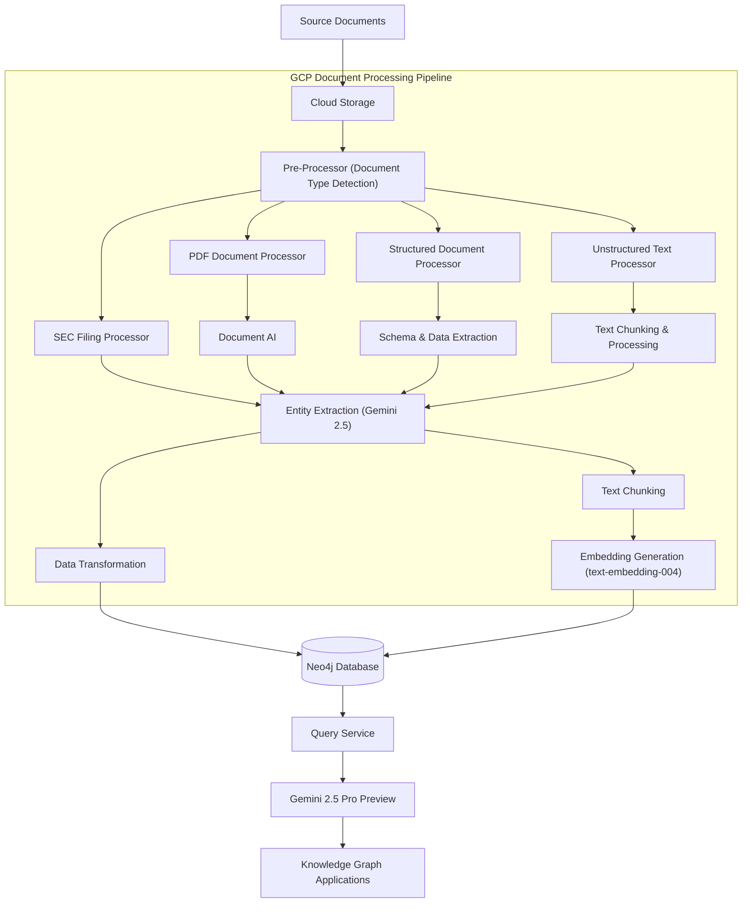

# Document Processing Architecture

## Overview

This document outlines the architecture for processing structured and unstructured documents using Google Cloud Platform (GCP) services and storing the results in Neo4j for knowledge graph applications. While the current implementation focuses on SEC Form-13D and 10-K filings, this architecture expands the capabilities to process any document type and build comprehensive knowledge graphs from them.

## Current Implementation and Modern Evolution

### Current Implementation
The existing implementation includes:
- Processing of SEC Form-13D and 10-K filings using Gemini models
- Entity extraction module (`entity_extraction.py`) for Form-13 data
- Text embedding module (`text_embedding.py`) for 10-K filings
- Google GenAI SDK integration for Vertex AI access (`genai_utils.py`)
- Direct loading to Neo4j through Python driver

### Modern GCP Pipeline Evolution
The evolved architecture leverages specialized GCP services to make document processing more robust and flexible:

1. **Document AI** - Replace custom parsers with managed document processing
2. **Vertex AI Gemini 2.5 Models** - Improved entity extraction and understanding
3. **Vector Search** - Managed vector operations with improved performance
4. **Document Processing Pipeline** - Scalable, managed processing workflows
5. **Cloud Storage** - Centralized document repository with versioning
6. **Neo4j AuraDB Vector Search** - Knowledge graph with vector capabilities

## Architecture Diagram



## Pipeline Components

### 1. Document Intake & Pre-Processing
- **Source Documents**: Multiple formats including SEC filings, PDFs, Word docs, spreadsheets, text files
- **Cloud Storage**: Central repository for all document types with versioning
- **Document Type Detection**: Automatic classification of incoming documents

### 2. Document Type-Specific Processing

#### SEC Filing Processing (Current Implementation)
- Specialized processing for Form-13D and 10-K filings
- XML parsing and extraction of structured data
- Maintains compatibility with current `entity_extraction.py` and `text_embedding.py`

#### Document AI Processing (New Capability)
- **Document Understanding**: Automatically parse layouts, tables, forms
- **Custom Processors**: Domain-specific processors for financial documents, contracts, etc.
- **OCR**: Extract text from scanned documents and images

#### Structured Document Processing (New Capability)
- **Schema Detection**: Automatically identify structure in JSON, CSV, XML files
- **Data Extraction**: Extract structured data with relationships preserved

#### Unstructured Text Processing (Enhanced Capability)
- **Semantic Chunking**: Intelligent document splitting beyond simple character counts
- **Multi-document Processing**: Handle document collections with cross-references

### 3. Knowledge Extraction

#### Entity Extraction with Gemini 2.5
- Enhanced extraction of entities, relationships, and attributes
- Function calling for structured data extraction
- Configurable extraction schema for different document types
- Consistent with current implementation but with improved capabilities

#### Text Processing for Vector Search
- Intelligent text chunking based on semantic boundaries
- Enhanced context preservation across chunks
- Integration with existing `text_embedding.py` module

### 4. Neo4j Knowledge Graph Integration

#### Data Transformation
- Convert extracted entities to Neo4j-compatible format
- Define node types, relationship types, and properties
- Create coherent graph schema across document types

#### Embedding Storage and Retrieval
- Store embeddings directly in Neo4j for vector search
- Enable semantic querying through vector-based retrieval
- Enhance current `import_embeddings_to_neo4j` functionality

## Implementation Strategy

### Phase 1: Enhance Current Implementation (Short-term)
1. Update existing modules to use Gemini 2.5 Pro Preview for improved extraction
2. Modernize text embedding with `text-embedding-004` model
3. Optimize Neo4j loading process for better performance
4. Add support for direct document uploads to Cloud Storage

### Phase 2: Document AI Integration (Medium-term)
1. Implement Document AI processors for key document types
2. Create a unified pre-processing pipeline for document classification
3. Develop adapters for different document types to standardize output
4. Build a document metadata system for tracking processing status

### Phase 3: Full Pipeline Automation (Long-term)
1. Deploy managed processing pipeline using Cloud Workflows or Dataflow
2. Implement event-driven processing for new document uploads
3. Create monitoring and alerting for processing failures
4. Build user interfaces for document upload and processing status

## Required GCP Services

- **Google GenAI SDK**: For Gemini 2.5 Pro Preview model access (existing)
- **Document AI**: For document understanding and form parsing (new)
- **Cloud Storage**: For document storage (existing)
- **Vertex AI**: For embedding generation (existing)
- **Cloud Workflows/Dataflow**: For pipeline orchestration (new)
- **Secret Manager**: For credential management (existing)

## Neo4j Configuration Updates

- **Vector Search Indexes**: Enable semantic search capabilities
- **Node Labels**: Expanded schema to support multiple document types
- **Relationship Types**: New relationship types for different document semantics
- **Constraints**: Additional uniqueness constraints for new entity types

## Knowledge Graph Schema

### Core Entity Types
- **Document**: Source documents with metadata
- **TextChunk**: Embedded text segments with vector embeddings
- **Entity**: Extracted entities (people, organizations, locations, etc.)
- **Concept**: Abstract concepts and topics
- **Financial**: Financial entities and instruments (from SEC filings)

### Example Relationships
- **CONTAINS**: Document to TextChunk relationship
- **MENTIONS**: TextChunk to Entity relationship
- **INVESTED_IN**: Investor to Company relationship (from SEC filings)
- **RELATES_TO**: Entity to Entity relationship
- **PART_OF**: Hierarchical relationships

## Implementation Example

```python
# Enhanced document processing using Gemini 2.5 and Document AI
# This integrates with the existing implementation

from google.cloud import documentai, storage
from google import genai
import os
from typing import Dict, List, Any
from pathlib import Path

from src.utils.genai_utils import extract_structured_data, get_text_embedding
from src.utils.neo4j_utils import Neo4jConnection

class DocumentProcessor:
    """Unified document processor for various document types"""
    
    def __init__(self, project_id: str, location: str = "us-central1"):
        self.project_id = project_id
        self.location = location
        self.storage_client = storage.Client(project=project_id)
        self.document_ai_client = documentai.DocumentProcessorServiceClient()
        genai.configure(vertexai=True, project=project_id, location=location)
    
    def detect_document_type(self, file_path: str) -> str:
        """Detect document type based on content and extension"""
        # Implementation to classify documents as SEC filings, PDFs, etc.
        # Can use simple heuristics or ML-based classification
        pass
    
    def process_sec_filing(self, file_path: str) -> Dict[str, Any]:
        """Process SEC filing using existing implementation"""
        # Leverage existing entity_extraction.py for Form-13
        # or text_embedding.py for 10-K
        from src.data_processing.entity_extraction import process_form13_file
        manager_info, filing_info = process_form13_file(file_path)
        return {"manager": manager_info, "filings": filing_info}
    
    def process_document_ai(self, file_path: str, processor_id: str) -> Dict[str, Any]:
        """Process document using Document AI"""
        # Implementation using Document AI processors
        pass
    
    def extract_entities(self, text: str, schema: Dict[str, Any]) -> Dict[str, Any]:
        """Extract structured data using Gemini 2.5"""
        return extract_structured_data(text, schema)
    
    def generate_embeddings(self, texts: List[str]) -> List[List[float]]:
        """Generate embeddings for text chunks"""
        return [get_text_embedding(text) for text in texts]
    
    def load_to_neo4j(self, data: Dict[str, Any]) -> None:
        """Load processed data to Neo4j"""
        with Neo4jConnection() as neo4j:
            # Implementation to load data to Neo4j
            pass
```

## Security Considerations

- Document data should be encrypted at rest and in transit
- Service accounts should follow principle of least privilege
- Neo4j connection details should be stored in Secret Manager
- Access to the document processing pipeline should be restricted
- Apply document level access controls for sensitive information

## Monitoring and Maintenance

- Set up monitoring for document processing pipeline
- Track document processing success/failure rates by document type
- Monitor Neo4j query performance with vector operations
- Set up alerts for pipeline failures and processing bottlenecks

## Next Steps

1. Update existing SEC filing processors to use Gemini 2.5 Pro Preview
2. Set up Document AI processors for PDF and form document types
3. Implement the document type detection and routing system
4. Enhance Neo4j schema to support multiple document types
5. Configure Neo4j for vector search operations
6. Create unified document processing CLI and API
